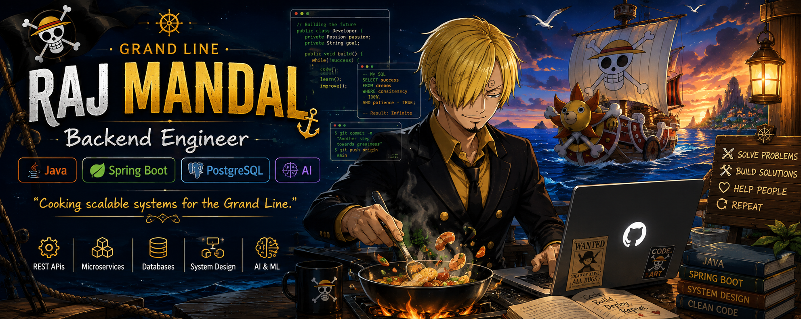
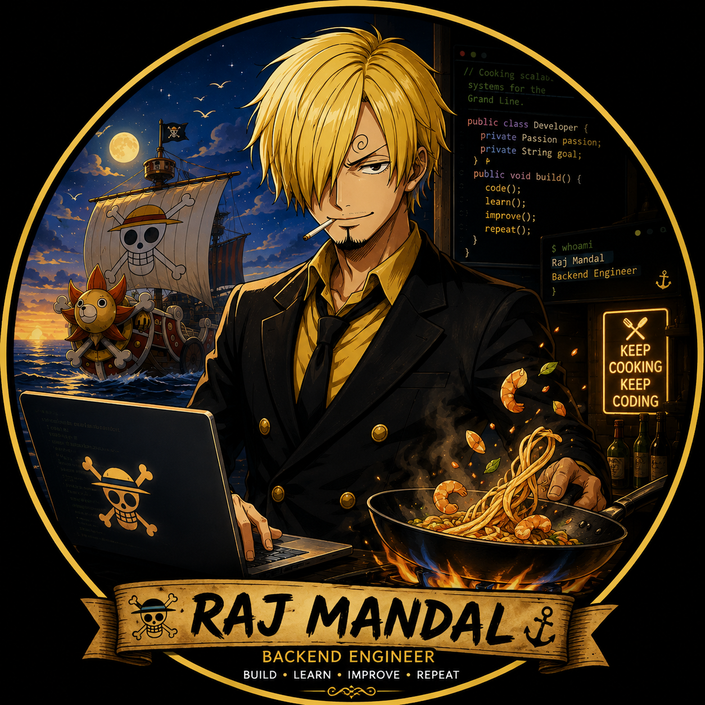

<p align="center">
  
</p>

<p align="center">
  
</p>

<p align="center">
  
</p>

<h1 align="center">🏴‍☠️ Raj Mandal</h1>

<h3 align="center">
Backend Engineer • Java • Spring Boot • AI Enthusiast
</h3>

<p align="center">

<a href="https://github.com/RajsProjects">

</a>

<a href="https://linkedin.com/in/suman-mandal-63b42a316">

</a>

<a href="mailto:sumanmandal8955@gmail.com">

</a>

</p>

---

# 🍳 `> whoami`

```yaml
name: Raj Mandal

role: Backend Engineer

location: India

currently:
  - Building scalable backend systems
  - Learning AI & Machine Learning
  - Mastering System Design

specialization:
  - Java
  - Spring Boot
  - REST APIs
  - PostgreSQL
  - MongoDB

goal:
  Become a Software Engineer building products
  that solve real-world problems.
```

---

# 💻 `> tech-stack`

<p align="center">


</p>

---

# ⚓ `> pirate-journey`

```text
East Blue
    │
    ▼
Java Programming
    │
    ▼
Spring Boot Development
    │
    ▼
Database Engineering
    │
    ▼
System Design
    │
    ▼
Artificial Intelligence
    │
    ▼
🏴‍☠️ Grand Line
```

---

# 🚀 `> featured-projects`

<details open>

<summary><b>🏴 Society Management SaaS</b></summary>

Modern society management platform.

**Tech Stack**

- Java
- Spring Boot
- MongoDB
- Redis
- Docker

**Highlights**

- Resident Management
- Billing System
- Complaint Portal
- Admin Dashboard
- Authentication
- Scalable REST APIs

</details>

<details>

<summary><b>⚡ LeetSync Engine</b></summary>

Automatically syncs LeetCode submissions to GitHub.

**Tech Stack**

- Java
- GitHub API
- GitHub Actions

</details>

---

# 📊 `> grand-line analytics`

<p align="center">


</p>

<p align="center">


</p>

---

# 📈 `> voyage-log`

<p align="center">


</p>

---

# 📚 `> currently-learning`

```yaml
Backend:
  - Spring Boot
  - Microservices
  - Redis
  - Kafka

Database:
  - PostgreSQL
  - Query Optimization

Cloud:
  - Docker
  - AWS

AI:
  - Python
  - Machine Learning
```

---

# 🎯 `> current-quest.yaml`

```yaml
building:
  - Society Management SaaS
  - LeetSync Engine

learning:
  - AI & Machine Learning
  - PostgreSQL Internals
  - Distributed Systems

target:
  - Backend Engineer
  - AI Engineer
```

---

# 📬 `> connect`

<p align="center">

<a href="https://github.com/RajsProjects">

</a>

<a href="https://linkedin.com/in/suman-mandal-63b42a316">

</a>

<a href="mailto:sumanmandal8955@gmail.com">

</a>

<a href="https://leetcode.com/u/Rajmandal5214/">

</a>

</p>

---

<div align="center">

### ⚓ *"The Grand Line isn't conquered in a day — it's conquered one commit at a time."*


<br>


</div>